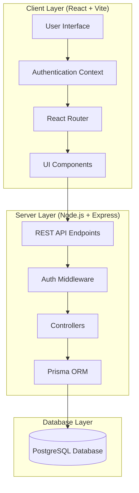
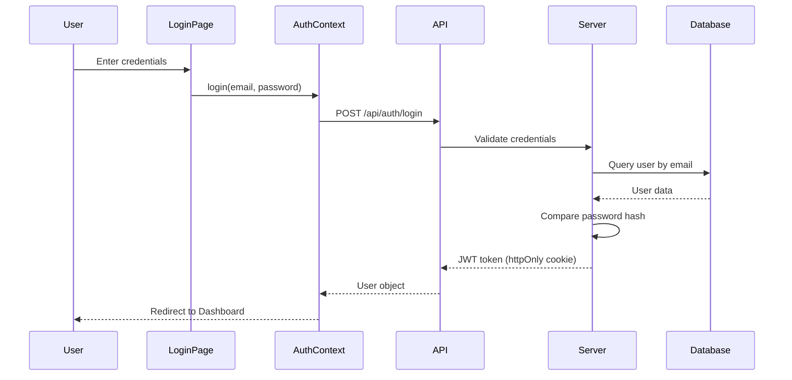
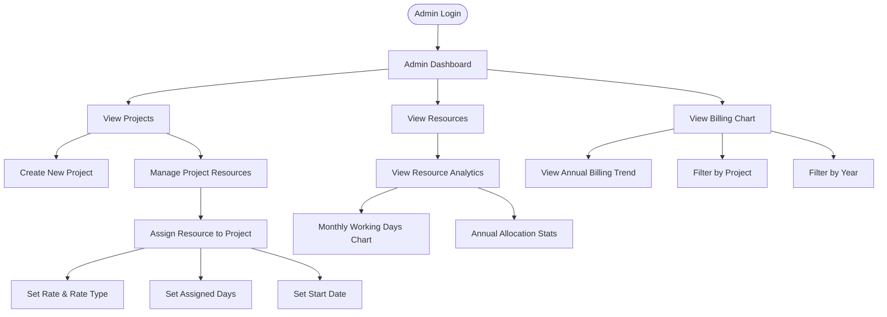
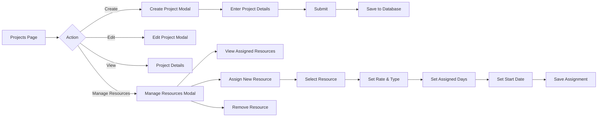
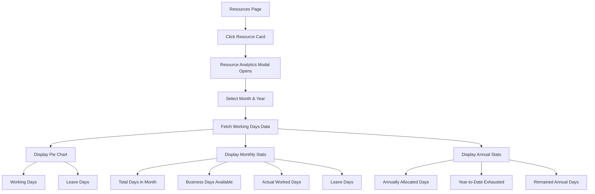
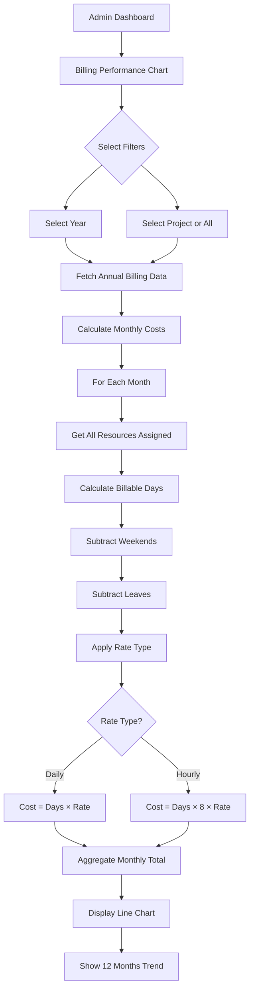
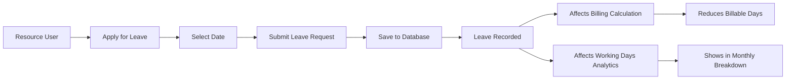
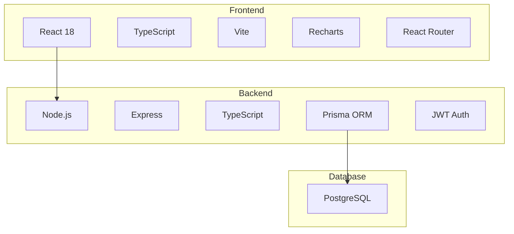

# HCLTech Billing Application - System Flowchart

## Application Architecture Overview



## User Authentication Flow



## Main Application Workflows

### 1. Admin Dashboard Flow



### 2. Project Management Flow



### 3. Resource Analytics Flow



### 4. Billing Performance Flow



### 5. Leave Management Flow



## Data Flow Architecture

```mermaid
graph LR
    subgraph "Frontend State Management"
        A[AuthContext] --> B[User State]
        C[API Service Layer] --> D[Axios Requests]
    end
    
    subgraph "API Routes"
        E[/api/auth/*] --> F[Auth Controller]
        G[/api/projects/*] --> H[Project Controller]
        I[/api/resources/*] --> J[Resource Controller]
        K[/api/billing/*] --> L[Billing Controller]
        M[/api/leaves/*] --> N[Leave Controller]
    end
    
    subgraph "Database Schema"
        O[User Table]
        P[Project Table]
        Q[ProjectResource Table]
        R[Leave Table]
        S[BillingReport Table]
    end
    
    D --> E
    D --> G
    D --> I
    D --> K
    D --> M
    
    F --> O
    H --> P
    H --> Q
    J --> O
    J --> Q
    L --> P
    L --> Q
    L --> R
    N --> R
```

## Key Features Summary

### Admin Features
- **Dashboard**: Overview of projects, resources, and billing performance
- **Project Management**: Create, edit, delete projects
- **Resource Assignment**: Assign resources to projects with rates and dates
- **Billing Analytics**: Annual trend visualization with project filtering
- **Resource Analytics**: Monthly and annual working days tracking

### Resource Features
- **Leave Application**: Apply for leaves (affects billing)
- **Working Days View**: See monthly breakdown and annual allocation
- **Settings**: Change password

### Automated Calculations
- **Billable Days**: Automatically excludes weekends and leaves
- **Rate Application**: Supports both daily and hourly rates
- **Annual Tracking**: Monitors allocated vs. exhausted days
- **Monthly Aggregation**: Calculates costs per month for trend analysis

## Technology Stack


